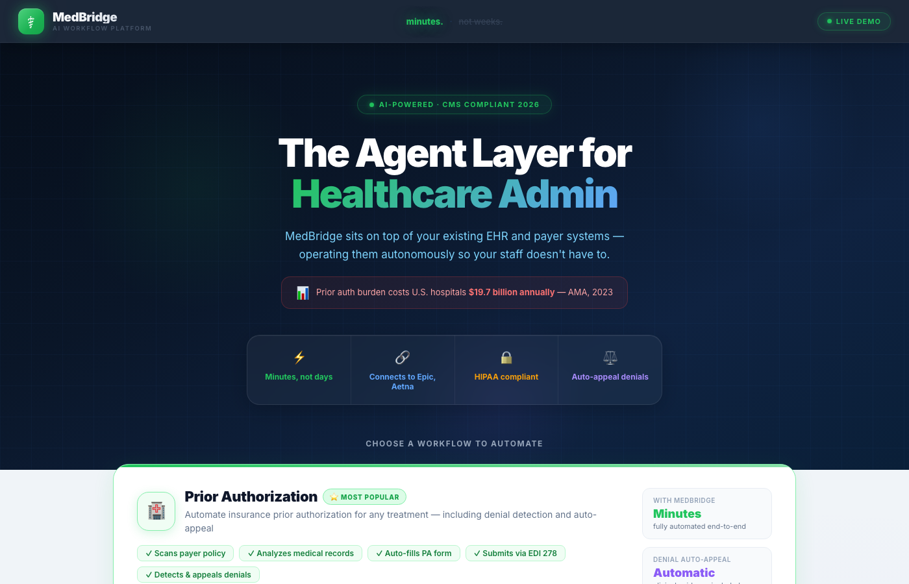
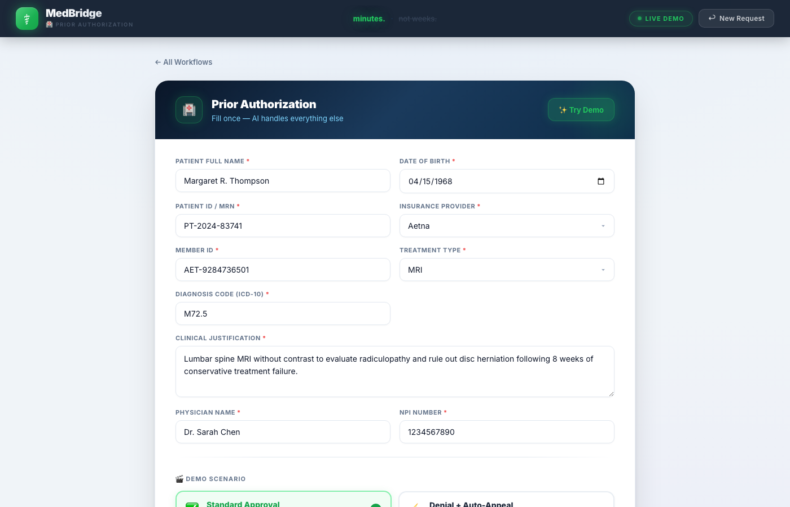
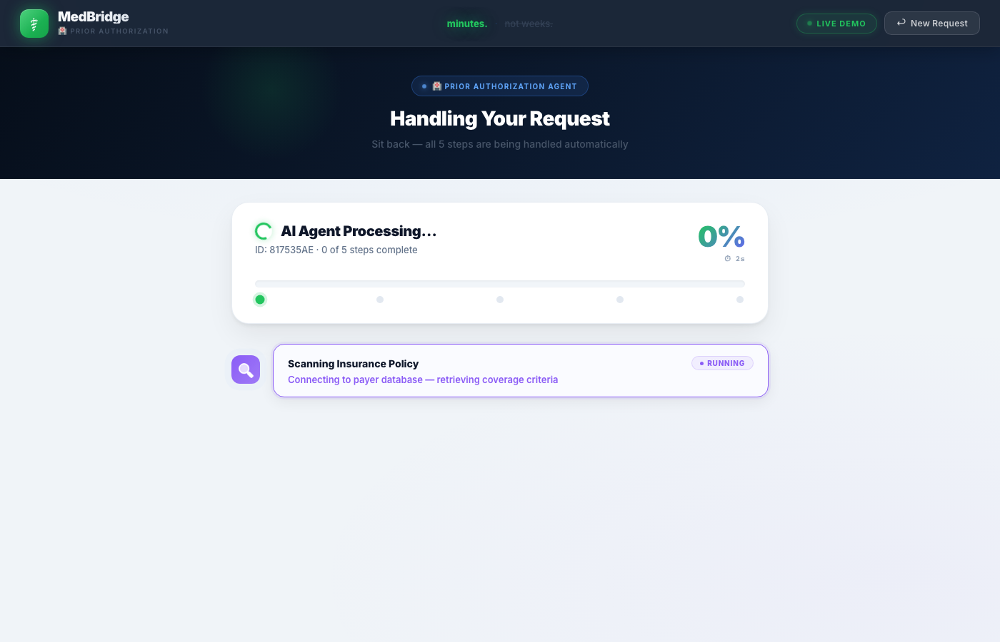
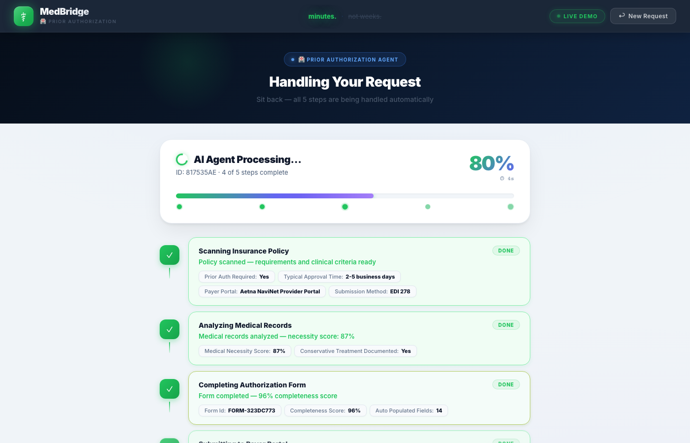

# MedBridge — AI Prior Authorization Agent

> Prior auth handled in minutes. Not days.

> 🏆 **1st Place Winner** — AI Agents Hackathon #33 (OSS4AI × Beta Fund × Gravitational Ventures) | Solo build, 36 hours.

MedBridge is an AI agent that automates healthcare prior authorization end-to-end — from scanning payer policies and analyzing medical records, to submitting via EDI 278 and auto-drafting appeals on denial. Built to attack the **$19.7B annual administrative burden** U.S. healthcare carries for a process that still runs on fax machines.

---

## The Problem

Every MRI, surgery, or specialist referral requires **prior authorization** before insurance pays. Today:

- Staff manually fills 10+ page forms and faxes them (yes, still fax)
- Payers take **3–5 business days** to respond
- **1 in 5** requests is denied — triggering hours more of manual appeal work
- Patients wait, untreated, while paperwork stalls care

$19.7B lost annually — not because the process is hard, but because humans are doing work that AI should handle.

---

## Screenshots

| Landing | Prior Auth Form |
|---|---|
|  |  |

| Agent Running | Workflow Progress |
|---|---|
|  |  |

---

## Presentation

[Watch Demo Video](https://drive.google.com/file/d/1cygGQlXmpLLv3FvAu5zmC6dwqmULOCZ2/view?usp=drive_link) · [Download Slide Deck (PDF)](presentation/MedBridge_Presentation_Deck.pdf)

---

## Demo

**Live demo patient:** Margaret R. Thompson · Lumbar MRI · Aetna · ICD-10 M72.5

Click **"✨ Try Demo"** on the form to auto-fill everything.

Two scenarios:
| Scenario | What you see |
|---|---|
| **Standard Approval** | Full prior auth submitted and confirmed end-to-end |
| **Denial + Auto-Appeal** | Auth denied → appeal drafted automatically in the same run |

---

## How It Works

MedBridge runs a real **agentic tool-use loop** — the LLM decides which tool to call next, observes the result, and continues until the workflow is complete. No hardcoded sequences.

| Step | Tool | What happens |
|------|------|-------------|
| 1 | `scan_insurance_policy` | Pulls coverage criteria and clinical requirements from payer database |
| 2 | `analyze_medical_records` | Evaluates patient history and establishes medical necessity |
| 3 | `fill_authorization_form` | Auto-populates all required fields — 96% completeness |
| 4 | `submit_authorization` | Transmits via EDI 278 to the payer portal |
| 5 | `track_authorization_status` | Checks initial decision, sets up real-time monitoring |
| 6 | `draft_appeal` *(if denied)* | Reads denial code, generates clinical appeal letter with supporting evidence |

### Denial Auto-Appeal — the key differentiator

When denied, MedBridge doesn't stop. It reads the denial reason (e.g. CO-50), pulls supporting clinical evidence, generates a formal CMS-compliant appeal letter, and queues it for physician co-signature and submission. A workflow that takes staff 2–3 days — done in seconds.

---

## Architecture

```
┌─────────────────────────────────────────────────────┐
│                   React Frontend                     │
│         (Vite · Real-time step polling)              │
└──────────────────────┬──────────────────────────────┘
                       │ HTTP + 1.5s polling
┌──────────────────────▼──────────────────────────────┐
│                  FastAPI Backend                     │
│         POST /api/workflow/submit                    │
│         GET  /api/workflow/{id}/status               │
└──────────────────────┬──────────────────────────────┘
                       │
┌──────────────────────▼──────────────────────────────┐
│               Agentic Runner                         │
│   LLM → tool_use → observe → repeat                  │
│   Providers: Groq (LLaMA 3.3-70B) · Gemini          │
└──────────────────────┬──────────────────────────────┘
                       │
┌──────────────────────▼──────────────────────────────┐
│           Healthcare Vertical (6 tools)              │
│   HIPAA-aware · EDI 278 · CMS 2026 compliant         │
│   Payers: Aetna · BCBS · UHC · Cigna · Humana        │
└─────────────────────────────────────────────────────┘
```

**Backend:** FastAPI · Python 3.11  
**AI:** Groq (LLaMA 3.3-70B) — real agentic tool-use, not a chatbot  
**Frontend:** React · Vite  
**State:** In-memory for demo — drop-in DB for production  

---

## Setup

### Prerequisites
- Python 3.11+
- Node.js 18+
- Groq API key — free at [console.groq.com](https://console.groq.com)

### 1. Environment

```env
# .env in project root
GROQ_API_KEY=your_groq_api_key_here
GEMINI_API_KEY=           # optional, for Gemini provider
```

### 2. Backend

```bash
cd backend
python -m venv venv
source venv/bin/activate      # Windows: venv\Scripts\activate
pip install -r requirements.txt
GROQ_API_KEY=your_key uvicorn main:app --host 0.0.0.0 --port 8000
```

### 3. Frontend

```bash
cd frontend
npm install
npm run dev
```

Open [http://localhost:5173](http://localhost:5173)

### Docker

```bash
docker-compose up
```

---

## API Reference

| Method | Endpoint | Description |
|--------|----------|-------------|
| `GET` | `/api/verticals` | List available workflow types |
| `POST` | `/api/workflow/submit` | Submit a new prior auth request |
| `GET` | `/api/workflow/{id}/status` | Poll for real-time status and step updates |
| `GET` | `/api/workflow/history/all` | List all past requests |
| `POST` | `/api/demo/reset` | Clear all in-memory state |
| `GET` | `/health` | Service health check |

### Submit Request Body

```json
{
  "vertical_id": "healthcare",
  "ai_provider": "groq",
  "form_data": {
    "patient_name": "Margaret R. Thompson",
    "patient_dob": "1968-04-15",
    "patient_id": "PT-2024-83741",
    "insurance_provider": "Aetna",
    "insurance_id": "AET-9284736501",
    "treatment_type": "MRI",
    "diagnosis_code": "M72.5",
    "treatment_description": "Lumbar spine MRI with and without contrast",
    "requesting_physician": "Dr. Sarah Chen",
    "physician_npi": "1234567890",
    "demo_scenario": "Standard Approval"
  }
}
```

---

## Roadmap

MedBridge is built as a vertical platform — adding a new workflow is one Python module. The agent loop, frontend, and polling are fully generic.

**Next healthcare workflows:**
- Step Therapy Exceptions — override fail-first drug requirements with clinical evidence
- Specialist Referrals — automate HMO referral submissions and approvals
- Medication Appeals — dispute formulary denials for non-covered drugs

---

## Built With

- [FastAPI](https://fastapi.tiangolo.com/) — async Python backend
- [Groq](https://groq.com/) — LLaMA 3.3-70B, free tier
- [React](https://react.dev/) + [Vite](https://vitejs.dev/) — frontend
- [Google Gemini](https://ai.google.dev/) — alternative AI provider

---

## License

All Rights Reserved. This project may not be used, copied, or distributed without explicit permission. See [LICENSE](LICENSE).
